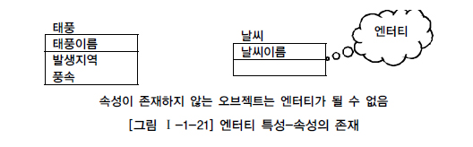

# 엔터티, 속성, 관계

# 엔터티
## 엔터티의 개념
- 업무에 필요하고 유용한 정보를 저장하고 관리하기 위한 집합적인 것(Things)이다.
  - 사람, 장소, 물건, 사건, 개념 등의 명사에 해당
  - 업무상 관리가 필요한 관심사에 해당
  - 저장이 되기 위한 어떤 것(Thing)

- 엔터티는 눈에 보이는(Tangible)한 것만이 아니며 눈에 보이지 않는 개념도 포함된다.

 

## 엔터티와 인스턴스에 대한 내용과 표기법

 

## 엔터티의 특징
- 도출된 엔터티가 다음의 성질을 만족하지 못하면 적절하지 않은 엔터티일 확률이 높다.
  - 해당 업무에 필요하고, 관리해야 하는 정보인가?

    

  - 유일한 식별자가 존재하는가?

    

  - 영속적으로 존재하는 인스턴스의 집합인가?

    

  - 업무 프로세스에 의해 이용되는가?

    

  - 속성이 존재하는가?

    

  - 다른 엔터티와 최소 한 개 이상의 관계가 존재하는가?

    

    - 예외적으로 통계성, 코드성, 시스템 처리시 내부 필요에 의한 엔터티 도출은 관계를 생략하게 된다.

 

## 엔터티의 분류

### 유무형에 따른 분류
- 유형 엔터티
  - 물리적인 형태가 있고 안정적이며 지속적으로 활용되는 정보
  - 업무로부터 엔터티를 구분하기가 가장 용이
  - 사원, 물품 등

- 개념 엔터티
  - 물리적인 형는 존재하지 않고 관리해야 할 개념적 정보
  - 조직, 휴가 등

- 사건 엔터티
  - 업무를 수행함에 따라 발생되는 정보
  - 주문, 청구, 신청, 결재 등

 

### 발생시점에 따른 분류
- 기본 엔터티
  - 업무에 원래 존재하는 정보로서 다른 엔터티와의 관계가 아닌 독립적으로 생성이 가능
  - 다른 엔터티로부터 주식별자를 상속받지 않고 고유한 주식별자를 소유
  - 사원, 조직, 고객, 상품 등

- 중심 엔터티
  - 업무에 있어서의 중심적인 역할을 하며 기본 엔터티로부터 발생
  - 다른 엔터티와의 관계로 많은 행위 엔터티를 생성
  - 주문, 청구, 매출, 신청 등

- 행위 엔터티
  - 두 개 이상의 부모 엔터티로부터 발생하고 자주 내용이 바뀌거나 데이터량이 증가
  - 분석 초기 단계에서는 잘 나타나지 않음
  - 상세 설계, 프로세스와 상관 모델링을 진행하면 도출될 수 있음
  - 주문목록, 사유 변경이력 등

 

### 엔터티 분류 방법의 예

 

### 엔터티의 명명
- 가능한 현업에서 사용하는 용어를 채택

- 약어 사용 지양

- 단수 명사 사용

- 중복되는 이름이 없어야 함

- 엔터티의 생성 의미대로 이름 부여

 

# 속성