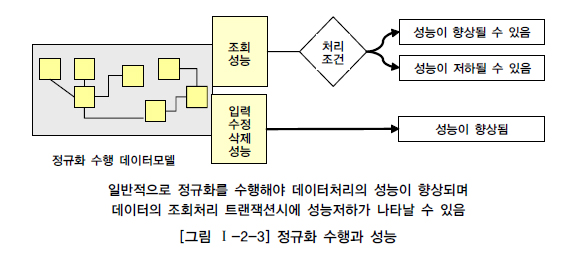
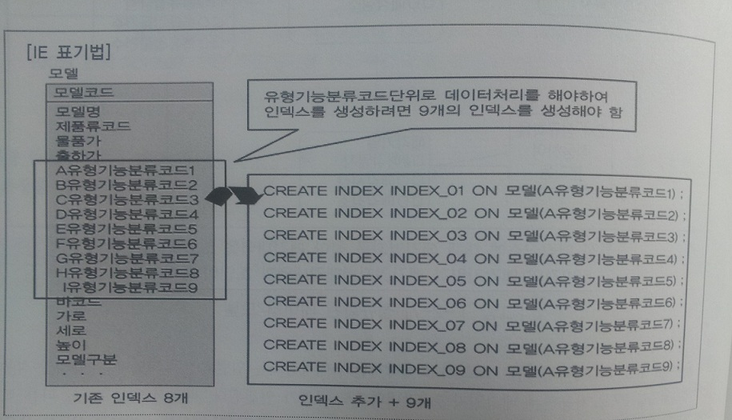
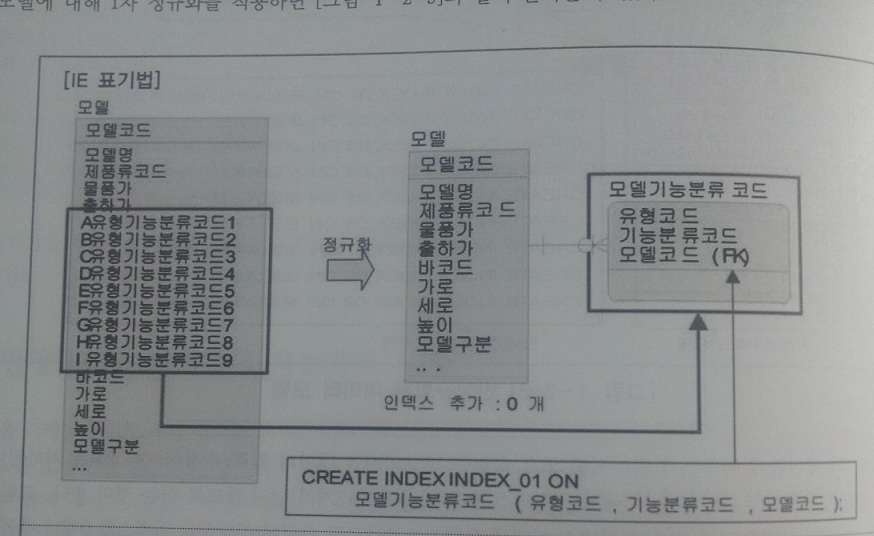
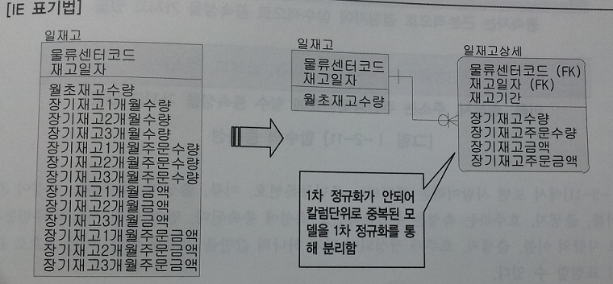
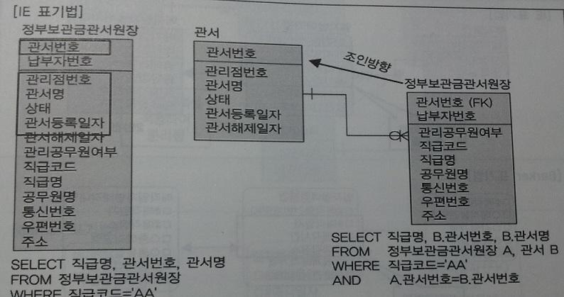
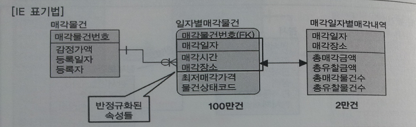
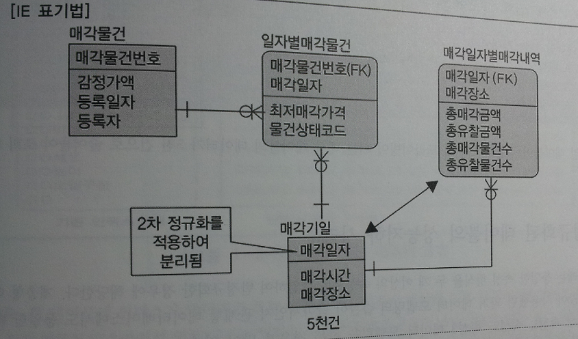
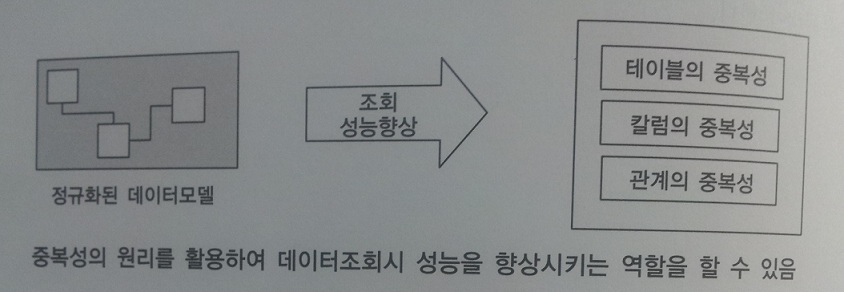
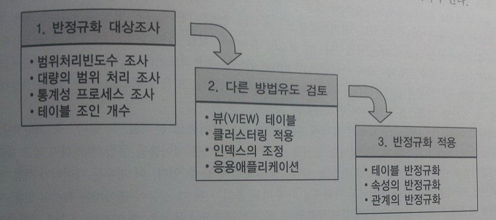

# 성능 데이터 모델링의 개요
## 성능 데이터 모델링의 정의
- 데이터베이스 성능 향상을 목적으로 설계 단계부터 정규화, 반정규화, 테이블 통합, 테이블 분할, 조인 구조, PK, FK 등 성능과 관련된 여러 사항이 데이터 모델링에 반영될 수 있도록 하는 것

 

## 성능 데이터 모델링 수행시점
- 사전에 할 수록 비용이 들지 않음

- 분석 및 설계 단계에서 성능을 고려하여 데이터 모델링을 수행하면 차후 성능 저하로 발생하는 재업무(Rework) 비용을 최소화 할 수 있음

- 비즈니스 처리에 핵심적인 트랜잭션이 있다면, 프로젝트 초기에 운영을 대비한 테스트 환경을 구축한 뒤 임의의 트랜잭션을 발생시켜 성능 테스트를 해야함

- 가장 적절한 구조인지 검토한 후 데이터 모델의 구조를 변경하며 디자인하는 전략 요구

 

## 성능 데이터 모델링 고려사항
- 데이터 모델링 수행 시 정확한 정규화
- 데이터베이스 용량 산정
- 데이터베이스에 발생 되는 트랜잭션의 유형 파악
- 용량과 트랜잭션 유형에 따른 반정규화 수행
- 이력 모델, PK/FK, 슈퍼타입/서브타입의 조정 등 수행
- 성능 관점에서의 데이터 모델 검증
  - 일반적인 데이터 모델 규칙뿐만 아니라 충분한 성능이 고려 되었는지 체크리스트에 포함

 

# 정규화와 성능
## 정규화의 개념
- 정규화(Normalization) : 다양한 유형의 검사로 데이터 모델을 구조화하고 개선시켜 나가는 절차에 관한 이론

  |정규화 종류|정규화 내용|
  |--------|--------|
  |1차 정규화|복수의 속성값을 갖는 속성을 분리|
  |2차 정규화|주식별자에 종속적이지 않은 속성을 분리. 부분종속 속성을 분리|
  |3차 정규화|속성에 종속적인 속성의 분리, 이전 종속(Transitive Dependency) 속성을 분리|
  |보이스-코드|정규화	다수의 주식별자 분리|
  |4차 정규화|다가 종속(Multi-Valued Dependency) 속성 분리|
  |5차 정규화|결합 종속(Join Dependency)일 경우는 두 개 이상의 N개로 분리|

 

## 정규화를 통한 성능 향상 전략
- 정규화는 기본적으로 데이터의 중복성을 제거하고 데이터를 관심사별로 모은다.
  - 엔터티와 조인이 많이 발생하는 상황에서는 정규화로 인해 성능이 저하되기도 하므로 반정규화를 적용하는 전략이 필요하다.

- 정규화를 수행하면 조회 성능이 항상 저하되는가?
  - 처리 조건에 따라 조회 성능이 향상될 수도, 저하될 수도 있다.
  - 정규화 모델은 일반적으로 반정규화 테이블보다 입력, 수정, 삭제 성능이 좋다.

 

## 반정규화 테이블의 성능 저하 사례 1

 

## 반정규화 테이블의 성능 저하 사례 2

 

## 반정규화 테이블의 성능 저하 사례 3

 

## 반정규화 테이블의 성능 저하 사례 4

## 함수적 종속성에 근거한 정규화
- 함수의 종속성(Functional Dependency) : 데이터가 어떠한 기준값에 의해 종속되는 현상
  - 기준값을 결정자(Determinant), 종속되는 값을 종속자(Dependent)라고 지칭
  - ex) 주민등록번호는 사람의 이름, 출생지, 주소로 생성되어 유일한 값을 가지므로 '주민번호가 이름, 출생지, 주소를 함수적으로 결정한다' 고 말할 수 있다.

- 함수의 종속성은 데이터의 근본적인 속성으로 정규화 또는 각 오브젝트에 속성을 배치할 때 이용된다.

 

# 반정규화와 성능
## 반정규화의 개념
- 반정규화 : 정규화 된 엔터티, 속성, 관계를 시스템의 성능 향상과 개발 및 운영의 단순화를 위해 중복, 통합, 분리 등을 수행하는 데이터 모델링 기법

- 반정규화 수행 상황
  - 디스크 I/O량이 많아 조회 성능이 저하되는 경우
  - 테이블 사이의 경로가 너무 멀어 조인으로 인한 성능이 저하되는 경우
  - 컬럼을 계산하여 읽을 때 성능이 저하 될것으로 예상되는 경우
  - 업무적으로 조회에 대한 처리 성능이 중요하다고 판단될 때 부분적으로 반정규화를 고려

- 일반적으로 설계단계에서 반정규화를 적용하며 반정규화 미수행시에는 다음과 같은 현상이 발생한다.
  - 성능이 저하된 데이터베이스가 생성될 수 있다.
  - 구축 또는 테스트 단계에서 반정규화를 적용하면 수정 비용이 많이든다.

 

## 반정규화 적용방법
- 반정규화의 필요성이 결정되면 컬럼, 테이블, 관계의 반정규화를 종합적으로 고려하여 적용

### 반정규화 적용 순서
- 반정규화 대상 조사
  - 자주 사용되는 테이블에 액세스하는 프로세스의 수가 가장 많고, 항상 일정한 범위만을 조회하는 경우
  - 테이블에 대량 또는 광범위한 데이터가 존재할 때 처리 성능을 보장할 수 없는 경우
  - 통계성 프로세스에 의한 정보가 필요한 경우 별도의 통계 테이블(반정규화) 생성
  - 테이블에 많은 조인으로 인해 데이터를 조회하는 것이 기술적으로 어려운 경우

- 반정규화 대상을 다른 방법으로 처리할 수 있는지 검토
  - 테이블에 많은 조인으로 데이터를 조회하는 것이 기술적으로 어려운 경우 View 검토
    - 조회성능을 향상 시키지는 않으나 SQL 작성의 미숙함으로 인한 성능 저하를 예방
  - 대량의 데이터 처리나 부분 처리에 의해 성능이 저하되는 경우 클러스터링을 적용하거나 인덱스 조정을 통해 성능 향상
  - 대량의 데이터는 PK의 성격에 따라 파티셔닝 기법을 적용하여 성능 저하를 방지
  - 어플리케이션에서 로직을 구현하는 방법을 변경하므로써 성능 향상

- 반정규화 적용
  - 반정규화 대상으로는 테이블, 속성, 관계에 대해 적용할 수 있으며 중복을 통한 방법뿐만 아니라 테이블, 속성, 관계를 추가/분할/제거할 수 있다.
