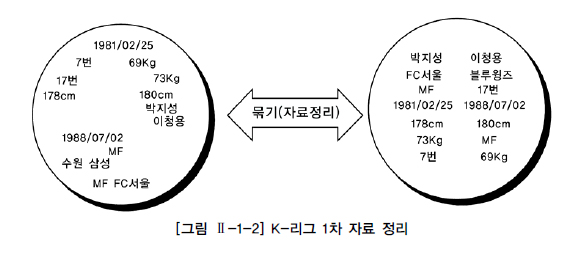
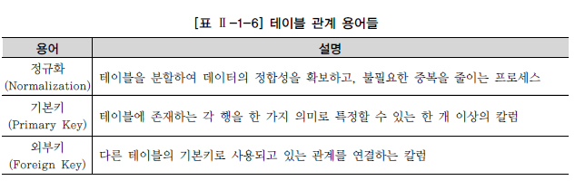

# 관계형 데이터베이스 개요
## 데이터베이스
### 데이터베이스의 개념
- 데이터베이스 : 일상적인 정보들의 집합 자체를 의미
  - 효율적인 데이터의 관리 뿐만 아니라 예기치 못한 사건으로 인한 데이터의 손상을 예방하고 데이터를 복구할 수 있는 강력한 기능의 소프트웨어가 필요
    - 이런 기본적인 요구사항을 만족시켜주는 시스템을 DBMS(Database Management System)라고 칭함

### 데이터베이스의 발전
- 1960년대
  - 플로우차트 중심의 개발 방법 사용, 파일 구조를 통해 데이터를 저장하고 관리

- 1970년대
  - 데이터베이스 관리 기법이 태동되던 시기로 계층형(Hierarchical) 데이터베이스, 망형(Network) 데이터베이스 제품 상용화

- 1980년대
  - 현재 대부분의 기업에서 사용되고 있는 관계형 데이터베이스 상용화(Oracle, Sybase, DB2)

- 1990년대
  - Oracle, Sybase, Informix, DB2, Teradata, SQL Server 등 보다 향상된 기능으로 정보시스템의 핵심 솔루션으로 부상
  - 인터넷 환경의 급속한 발전과 객체 지향 정보를 지원하기 위해 객체 관계형 데이터베이스로 발전

 

### 파일시스템
- 하나의 파일을 많은 사용자가 동시에 검색할 수는 있지만 동시에 입력, 수정, 삭제할 수 없기 때문에 정보의 관리가 어려움
  - 하나의 파일을 여러 사용자나 어플리케이션에서 동시에 사용하기 위해서 원래의 데이터 파일을 여러 개 복사하여 사용

- 여러 개의 데이터 파일이 존재하는 경우 동일한 데이터가 여러 곳에 저장됨
  - 하나의 원본에 변경 작업이 일어날 때 모든 복사본을 병행하여 수정하지 않으면 서로 다른 정보 파일이 존재하게 되므로 데이터의 불일치성이 발생
  - 이렇듯 분산된 데이터의 정합성을 보장하기 힘들며 유지하는데 과다한 노력이 필요하다.

- 단일 사용자나 단일 어플리케이션이 파일시스템을 사용하면 데이터베이스보다 처리 성능이 뛰어나므로 특정 업무에서는 아직도 파일시스템을 사용

 

### 관계형 데이터베이스(Relational Database)
- 1970년 영국의 수학자였던 E.F. Codd 박사의 논문에서 처음으로 관계형 데이터베이스가 소개
  - IBM의 SQL 개발 단계를 거쳐서 Oracle을 선두로 여러 회사에서 제품 상용화
  - 기존의 파일시스템과 계층 및 망형 데이터베이스를 대부분 대체하면서 주력 데이터베이스로 부상

- 정규화를 통한 합리적인 테이블 모델링으로 이상(ANOMALY) 현상을 제거하고 동시성 관리 및 병행 제어할 수 있어 사용자들이 동시에 데이터를 공유 및 조작 가능

- 메타 데이터를 총괄 관리할 수 있기 때문에 데이터의 성격, 속성 또는 표현 방법 등을 체계화할 수 있고 데이터 표준화를 통한 데이터 품질을 확보할 수 있는 장점 존재
  - 인증된 사용자만이 참조할 수 있도록 보안 기능 포함

- 테이블 생성 시 다양한 제약조건을 이용하여 조건에 위배되는 데이터가 입력되거나 관계 연결에서의 중요 데이터 삭제를 방지하여 데이터 무결성(Integrity)을 보장

- 시스템의 갑작스런 장애로부터 사용자가 입력, 수정, 삭제하던 데이터가 제대로 반영될 수 있도록 보장해주는 기능 보유
  - 시스템 다운, 재해 등의 상황에서 데이터를 회복/복구할 수 있는 기능도 제공

 

## SQL(Structured Query Language)
### SQL(Structured Query Language)의 개념
- 관계형 데이터베이스에서 데이터 정의, 데이터 조작, 데이터 제어를 위해 사용하는 언어
  - SQL의 최초 이름이 SEQUEL(Structured English QUEry Language)이었기 때문에 '시큐얼'로 읽는 경우도 있지만, 표준은 SQL이므로 '에스큐엘'로 읽는 것을 권고

- 1986년부터 ANSI/ISO를 통해 표준화되고 정의된 SQL 기능은 벤더별 DBMS 개발의 목표가 됨
  - 대부분의 관계형 데이터베이스에서 ANSI/ISO 표준을 최대한 따르고 있기 때문에, SQL에 대한 지식은 다른 데이터베이스를 사용하더라도 상당 부분 재활용 가능
  - ANSI/IS0 SQL-99, SQL-2003 이후 기준이 적용된 SQL이라면 프로그램의 이식성을 높이는 데도 공헌

- SQL 문장은 일반적인 개발 언어처럼 독립된 하나의 언어
  - 일반적인 프로그래밍 언어와는 달리 관계형 데이터베이스에 대한 전담 접속(다른 언어는 관계형 데이터베이스에 접속할 수 없다)
  - 세미콜론( ; ) 으로 분리되어 있는 SQL 문장 단위로 독립

- 관계형 데이터베이스는 수학의 집합 논리에 입각한 것이므로, SQL도 데이터를 집합으로써 취급

 

### SQL 문장

 

### TABLE

- 데이터는 관계형 데이터베이스의 기본 단위인 테이블 형태로 저장
  - 모든 자료는 테이블에 등록 되고 사용자는 테이블로부터 원하는 자료를 조회한다.
  - 결국 테이블은 어느 특정한 주제와 목적으로 만들어지는 일종의 집합이다.

- 테이블에 등록된 자료들은 삭제하지 않는 한 지속적으로 유지
  - 자료를 입력하지 않는다면 테이블은 생성되었을 때부터 가지던 속성을 그대로 유지하면서 존재

- 테이블(TABLE)은 데이터를 저장하는 객체(Object)로서 관계형 데이터베이스의 기본 단위이다.

- 관계형 데이터베이스에서는 모든 데이터를 칼럼과 행의 2차원 구조로 나타낸다.

- 세로 방향을 칼럼(Column), 가로 방향을 행(Row)이라고 하고, 칼럼과 행이 겹치는 하나의 공간을 필드(Field)라고 한다.
  - 선수 정보 테이블에서는 선수명과 포지션 등의 칼럼이 있고, 각 선수에 대한 데이터를 행으로 구성하여 저장한다.

    

- 모든 데이터를 하나의 테이블로 저장하지 않는다.
  - 테이블을 분할하여 데이터의 불필요한 중복을 줄이는 것을 정규화(Normalization)라고 한다.
  - 데이터의 정합성 확보와 데이터 입력/수정/삭제 시 발생할 수 있는 이상 현상(Anomaly)을 방지하기 위함이다.

    

- 각 행을 한 가지 의미로 특정할 수 있는 한 개 이상의 칼럼을 기본키(Primary Key)라고 한다.
  - 다른 테이블의 기본 키로 사용되면서 테이블과의 관계를 연결하는 역할을 하는 칼럼을 외부키(Foreign Key)라고 한다.

    

 

### ERD
- 테이블 간 서로의 상관 관계를 그림으로 도식화한 것을 E-R 다이어그램이라고 하며, ERD라 칭함

- 구성 요소는 엔터티(Entity), 관계(Relationship), 속성(Attribute) 3가지이며 현실 세계의 데이터는 이 3가지 구성 요소로 모두 표현이 가능

